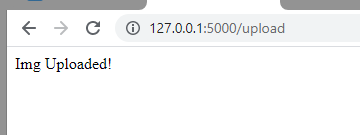
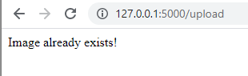
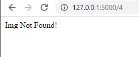

# Image Upload API

Here, using this API, we can upload image and view it  
 

## Image Upload

On sending *POST* request with choosing image file from frontend, the API will add this data to database. The below image demonstartes the same:  
> File selection: 
  
> If File is Sucessfully Uploaded: 
  
> If File already exists in the DB: 
  
  

## Retriving the Image

On sending *GET* request with writing the image ID as it's Parameter, the API will fetch its data from database. The below image demonstartes the same:  
> If File exists: 
  
> If file with respective ID not found: 
  
  

